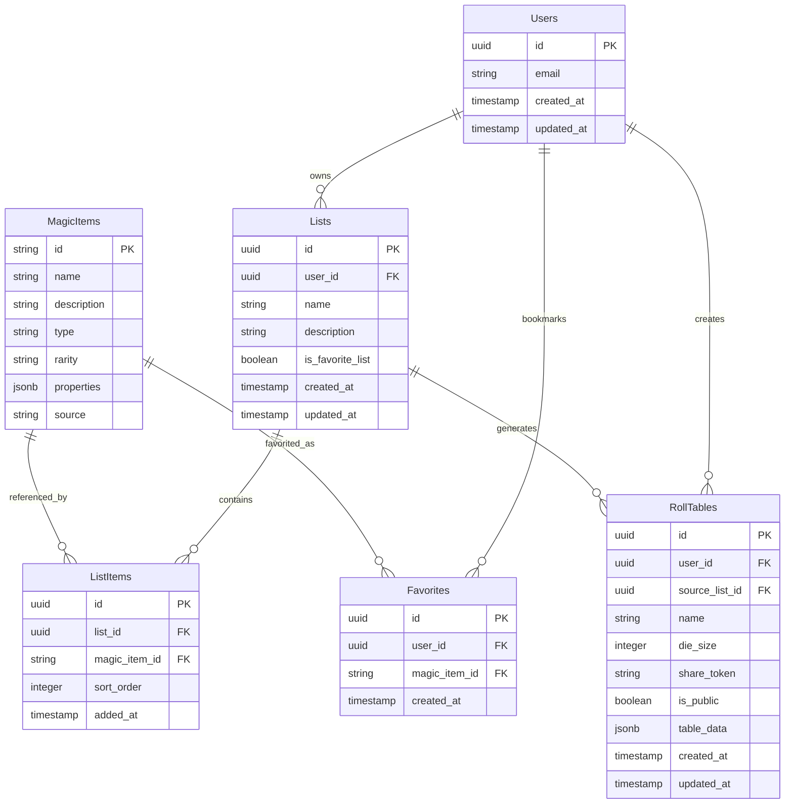

# Data Model: Shadowdark Magic Item Web App

**Feature**: Shadowdark Magic Item Web App
**Date**: 2025-01-23
**Status**: Complete

## Entity Relationships



## Entity Definitions

### Users
**Purpose**: Authenticated users who can create lists and tables
**Storage**: Supabase Auth + custom profile table

| Field | Type | Constraints | Description |
|-------|------|-------------|-------------|
| id | uuid | PK, NOT NULL | Supabase Auth user ID |
| email | string | UNIQUE, NOT NULL | User email from auth |
| created_at | timestamp | NOT NULL, DEFAULT now() | Account creation time |
| updated_at | timestamp | NOT NULL, DEFAULT now() | Last profile update |

**Validation Rules**:
- Email must be valid format (handled by Supabase Auth)
- Maximum 100 lists per user
- Row Level Security: Users can only access their own data

### MagicItems (JSON Source)
**Purpose**: Static reference data for Shadowdark RPG magic items
**Storage**: JSON file, no database storage needed

| Field | Type | Constraints | Description |
|-------|------|-------------|-------------|
| id | string | PK, NOT NULL | Unique identifier (slug format) |
| name | string | NOT NULL | Display name of magic item |
| description | string | NOT NULL | Full item description |
| type | string | NOT NULL | Item category (weapon, armor, etc.) |
| rarity | string | NOT NULL | Rarity tier (common, rare, etc.) |
| properties | object | - | Additional item properties |
| source | string | - | Source book/reference |

**Validation Rules**:
- All fields required for search functionality
- ID must be URL-safe for routing
- Description supports markdown formatting

### Lists
**Purpose**: User-created collections of magic items
**Storage**: Supabase table with RLS

| Field | Type | Constraints | Description |
|-------|------|-------------|-------------|
| id | uuid | PK, NOT NULL | Unique list identifier |
| user_id | uuid | FK, NOT NULL | Owner reference |
| name | string | NOT NULL, MAX 100 chars | User-defined list name |
| description | string | MAX 500 chars | Optional list description |
| is_favorite_list | boolean | DEFAULT false | Special "favorites" list marker |
| created_at | timestamp | NOT NULL, DEFAULT now() | Creation timestamp |
| updated_at | timestamp | NOT NULL, DEFAULT now() | Last modification |

**Validation Rules**:
- Each user limited to 100 lists
- List names must be unique per user
- One favorites list per user (auto-created)
- RLS: Users can only access their own lists

**State Transitions**:
- Created → Active → Updated → Active (repeat)
- Active → Deleted (soft delete with confirmation)

### ListItems
**Purpose**: Junction table linking lists to magic items
**Storage**: Supabase table with RLS

| Field | Type | Constraints | Description |
|-------|------|-------------|-------------|
| id | uuid | PK, NOT NULL | Unique item reference |
| list_id | uuid | FK, NOT NULL | Parent list reference |
| magic_item_id | string | FK, NOT NULL | Magic item reference |
| sort_order | integer | NOT NULL, DEFAULT 0 | Display order in list |
| added_at | timestamp | NOT NULL, DEFAULT now() | When item was added |

**Validation Rules**:
- Composite unique constraint on (list_id, magic_item_id)
- sort_order automatically managed on insertion
- RLS: Inherits access from parent list

### RollTables
**Purpose**: Generated tables for random magic item selection
**Storage**: Supabase table with RLS

| Field | Type | Constraints | Description |
|-------|------|-------------|-------------|
| id | uuid | PK, NOT NULL | Unique table identifier |
| user_id | uuid | FK, NULL | Owner (NULL for anonymous) |
| source_list_id | uuid | FK, NULL | Source list if applicable |
| name | string | NOT NULL, MAX 100 chars | Table name |
| die_size | integer | NOT NULL, MIN 1, MAX 10000 | Die size for rolling |
| share_token | string | UNIQUE, NOT NULL | URL-safe sharing token |
| is_public | boolean | DEFAULT false | Currently unused (future feature) |
| table_data | jsonb | NOT NULL | Complete table structure |
| created_at | timestamp | NOT NULL, DEFAULT now() | Creation timestamp |
| updated_at | timestamp | NOT NULL, DEFAULT now() | Last modification |

**Validation Rules**:
- die_size between 1 and 10,000
- share_token must be unique and URL-safe
- table_data contains roll mappings and metadata
- RLS: Owner can edit, anyone can view with share_token

**Table Data Structure**:
```typescript
interface TableData {
  rolls: Array<{
    roll: number;
    magicItemId: string | null;
    customText?: string;
  }>;
  metadata: {
    generatedAt: string;
    sourceListName?: string;
    fillStrategy: 'auto' | 'manual' | 'blank';
  };
}
```

### Favorites
**Purpose**: User bookmarks for quick access to items
**Storage**: Supabase table with RLS

| Field | Type | Constraints | Description |
|-------|------|-------------|-------------|
| id | uuid | PK, NOT NULL | Unique favorite reference |
| user_id | uuid | FK, NOT NULL | User who favorited |
| magic_item_id | string | FK, NOT NULL | Favorited magic item |
| created_at | timestamp | NOT NULL, DEFAULT now() | When favorited |

**Validation Rules**:
- Composite unique constraint on (user_id, magic_item_id)
- No limit on number of favorites per user
- RLS: Users can only access their own favorites

## Database Schema (SQL)

```sql
-- Enable Row Level Security
ALTER DATABASE SET row_security = on;

-- Users table (extends Supabase auth.users)
CREATE TABLE public.users (
  id UUID REFERENCES auth.users(id) PRIMARY KEY,
  email TEXT NOT NULL,
  created_at TIMESTAMP WITH TIME ZONE DEFAULT now() NOT NULL,
  updated_at TIMESTAMP WITH TIME ZONE DEFAULT now() NOT NULL
);

-- Lists table
CREATE TABLE public.lists (
  id UUID DEFAULT gen_random_uuid() PRIMARY KEY,
  user_id UUID REFERENCES public.users(id) ON DELETE CASCADE NOT NULL,
  name TEXT NOT NULL CHECK (length(name) <= 100),
  description TEXT CHECK (length(description) <= 500),
  is_favorite_list BOOLEAN DEFAULT false,
  created_at TIMESTAMP WITH TIME ZONE DEFAULT now() NOT NULL,
  updated_at TIMESTAMP WITH TIME ZONE DEFAULT now() NOT NULL,
  UNIQUE(user_id, name)
);

-- List items junction table
CREATE TABLE public.list_items (
  id UUID DEFAULT gen_random_uuid() PRIMARY KEY,
  list_id UUID REFERENCES public.lists(id) ON DELETE CASCADE NOT NULL,
  magic_item_id TEXT NOT NULL,
  sort_order INTEGER DEFAULT 0 NOT NULL,
  added_at TIMESTAMP WITH TIME ZONE DEFAULT now() NOT NULL,
  UNIQUE(list_id, magic_item_id)
);

-- Roll tables
CREATE TABLE public.roll_tables (
  id UUID DEFAULT gen_random_uuid() PRIMARY KEY,
  user_id UUID REFERENCES public.users(id) ON DELETE CASCADE,
  source_list_id UUID REFERENCES public.lists(id) ON DELETE SET NULL,
  name TEXT NOT NULL CHECK (length(name) <= 100),
  die_size INTEGER NOT NULL CHECK (die_size >= 1 AND die_size <= 10000),
  share_token TEXT UNIQUE NOT NULL,
  is_public BOOLEAN DEFAULT false,
  table_data JSONB NOT NULL,
  created_at TIMESTAMP WITH TIME ZONE DEFAULT now() NOT NULL,
  updated_at TIMESTAMP WITH TIME ZONE DEFAULT now() NOT NULL
);

-- Favorites
CREATE TABLE public.favorites (
  id UUID DEFAULT gen_random_uuid() PRIMARY KEY,
  user_id UUID REFERENCES public.users(id) ON DELETE CASCADE NOT NULL,
  magic_item_id TEXT NOT NULL,
  created_at TIMESTAMP WITH TIME ZONE DEFAULT now() NOT NULL,
  UNIQUE(user_id, magic_item_id)
);

-- Row Level Security Policies
-- Users: Users can only see/edit their own profile
CREATE POLICY "Users can view own profile" ON public.users FOR SELECT USING (auth.uid() = id);
CREATE POLICY "Users can update own profile" ON public.users FOR UPDATE USING (auth.uid() = id);

-- Lists: Users can only access their own lists
CREATE POLICY "Users can view own lists" ON public.lists FOR SELECT USING (auth.uid() = user_id);
CREATE POLICY "Users can create own lists" ON public.lists FOR INSERT WITH CHECK (auth.uid() = user_id);
CREATE POLICY "Users can update own lists" ON public.lists FOR UPDATE USING (auth.uid() = user_id);
CREATE POLICY "Users can delete own lists" ON public.lists FOR DELETE USING (auth.uid() = user_id);

-- List Items: Users can only access items in their own lists
CREATE POLICY "Users can view own list items" ON public.list_items FOR SELECT
  USING (list_id IN (SELECT id FROM public.lists WHERE user_id = auth.uid()));
CREATE POLICY "Users can manage own list items" ON public.list_items FOR ALL
  USING (list_id IN (SELECT id FROM public.lists WHERE user_id = auth.uid()));

-- Roll Tables: Users can edit their own, anyone can view shared tables
CREATE POLICY "Users can view own roll tables" ON public.roll_tables FOR SELECT
  USING (auth.uid() = user_id OR user_id IS NULL);
CREATE POLICY "Anyone can view shared tables" ON public.roll_tables FOR SELECT
  USING (share_token IS NOT NULL);
CREATE POLICY "Users can manage own roll tables" ON public.roll_tables FOR ALL
  USING (auth.uid() = user_id OR user_id IS NULL);

-- Favorites: Users can only access their own favorites
CREATE POLICY "Users can view own favorites" ON public.favorites FOR SELECT USING (auth.uid() = user_id);
CREATE POLICY "Users can manage own favorites" ON public.favorites FOR ALL USING (auth.uid() = user_id);

-- Enable RLS on all tables
ALTER TABLE public.users ENABLE ROW LEVEL SECURITY;
ALTER TABLE public.lists ENABLE ROW LEVEL SECURITY;
ALTER TABLE public.list_items ENABLE ROW LEVEL SECURITY;
ALTER TABLE public.roll_tables ENABLE ROW LEVEL SECURITY;
ALTER TABLE public.favorites ENABLE ROW LEVEL SECURITY;

-- Indexes for performance
CREATE INDEX idx_lists_user_id ON public.lists(user_id);
CREATE INDEX idx_list_items_list_id ON public.list_items(list_id);
CREATE INDEX idx_list_items_magic_item_id ON public.list_items(magic_item_id);
CREATE INDEX idx_roll_tables_user_id ON public.roll_tables(user_id);
CREATE INDEX idx_roll_tables_share_token ON public.roll_tables(share_token);
CREATE INDEX idx_favorites_user_id ON public.favorites(user_id);
CREATE INDEX idx_favorites_magic_item_id ON public.favorites(magic_item_id);
```

## TypeScript Type Definitions

```typescript
// Generated from Supabase schema
export interface Database {
  public: {
    Tables: {
      users: {
        Row: {
          id: string;
          email: string;
          created_at: string;
          updated_at: string;
        };
        Insert: {
          id: string;
          email: string;
          created_at?: string;
          updated_at?: string;
        };
        Update: {
          id?: string;
          email?: string;
          created_at?: string;
          updated_at?: string;
        };
      };
      // ... additional table definitions
    };
  };
}

// Magic Item (from JSON)
export interface MagicItem {
  id: string;
  name: string;
  description: string;
  type: string;
  rarity: string;
  properties?: Record<string, unknown>;
  source?: string;
}

// Roll Table Data
export interface RollTableData {
  rolls: Array<{
    roll: number;
    magicItemId: string | null;
    customText?: string;
  }>;
  metadata: {
    generatedAt: string;
    sourceListName?: string;
    fillStrategy: 'auto' | 'manual' | 'blank';
  };
}
```